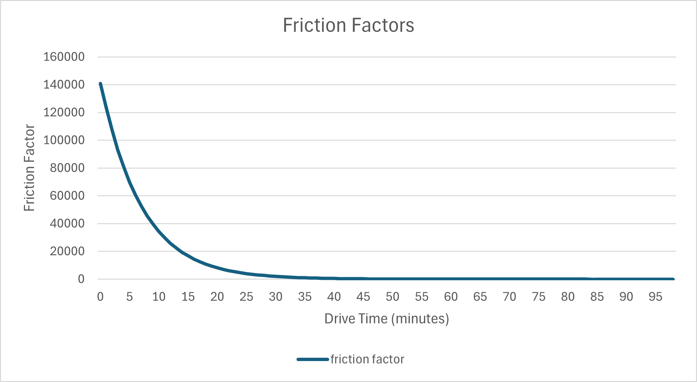

----------------------
Activity Demand Models
----------------------

^^^^^^^^^^^^^^^^^^^^^^^^^^^^^^^^^^
DaySim Activity-Based Demand Model
^^^^^^^^^^^^^^^^^^^^^^^^^^^^^^^^^^

SF-CHAMP 6.0 uses the `DaySim demand model <https://github.com/RSGInc/DaySim/wiki>`_. DaySim is an open-source travel demand microsimulation package that is used by several regional planning organizations in their travel demand models. DaySim consists of a series of discrete choice models that represent different components of travel decision-making. Each model is estimated and calibrated with observed travel survey data.
This is an abridged list of DaySim submodels and some of the primary factors that influence choice-making in each model, roughly presented in order:

*	**Work location model.** Major sensitivities include: full or part-time status, distance, income, sex, and quantity of jobs by industry sector
*	**School location model.** Major sensitivities include: student age, distance, and school enrollment in base year by school level
*	**Auto ownership.** Major sensitivities include: number of drivers in household, numbers of household members of various status (child, student, worker, retired, etc.), household income, commute/school logsum benefit of car ownership (how much would car ownership improve work commute or school accessibility), distance to transit stops, parking prices near home, amount of food, retail, service, and medical employment near home
*	**Person day pattern.** Major sensitivities include: worker/student status, income, auto ownership, sex, age, activity purpose, land use attributes, family composition (e.g. has children in household)
*	**Tour destination models (work, other, subtour).**	Major sensitivities include: full-time worker status, part-time worker status, student status, employment density, is/is not usual workplace, distance, activity purpose, day pattern, home/non-home based, income, auto availability, other land use attributes
*	**Tour mode models (work, school, work-based, escort, other home based).** Major sensitivities include: travel time, transit fares, tolls, parking cost, income, age, sex, auto ownership, household size, children in household, origin and destination land use attributes, stops in tour pattern by activity purpose
*	**Tour time models (work, school, other work-based).**	Major sensitivities include: tour mode, activity purpose, day pattern (other tours in day, tour order, etc.), worker and student status, income
*	**Intermediate stop generation model.**	Major sensitivities include: tour purpose, number of tours in day pattern,  time of day, duration of tour time window, sex, age, household type, tour mode, worker status, children in household status, position of stop within tour
*	**Intermediate stop location model.**	Major sensitivities include: stop activity purpose, travel time available, distance, income, tour purpose, tour mode, land use attributes (employment density, etc.), 
*	**Trip mode model.** Major sensitivities include: tour mode, activity purpose, travel time, transit fares, tolls, parking cost, auto ownership, household size, household composition (children in household), land use density, intersection density, age, income
*	**Trip time model.** Major sensitivities include: student status, age, minutes available in schedule, remaining stops to make, activity purpose

See Daysim's `Standard Technical Documentation <https://github.com/RSGInc/DaySim/wiki/docs/DaySim%20Standard%20Technical%20Documentation.docx>`_ for model system workflow, component documentation, and more. 

Distributed Values of Time
~~~~~~~~~~~~~~~~~~~~~~~~~~

The utility of money should vary with income, as well as with personal circumstances. It makes sense that a single person earning $100,000 per year would have a different utility for money than someone trying to raise a family of four on the same income. It also makes sense for those two individuals to have very different utilities of time, where one traveler may need to make it to his child’s soccer game, and another may have no specific time restrictions.

In a mode choice model, value-of-time is not an explicit model coefficient, but implied from the ratio of the time coefficient and the cost coefficient. Therefore, there are three possible ways to incorporate a distributed value of time in a mode choice model—using a distributed time coefficient, using a distributed cost coefficient, or using distributed values of both.

Daysim accounts for this in two ways: by varying the cost coefficient according to income, and by varying the time coefficient randomly. Daysim calculates the cost coefficient for each tour (in the PathTypeModel step), using a base cost coefficient and adjusting according to the household income and purpose associated with the tour: 

.. math::
	\begin{equation}
		CostCoefficient = \frac{BaseCostPerDollar}{(HH\_income/BaseCostIncomeLevel)^{CostIncomePower}}
	\end{equation}
	
The parameters for the cost coefficient calculation are defined below:

.. csv-table:: 
   :header: "Parameter", "Value"
	
	"BaseCostPerDollar",    -0.15
	"BaseCostIncomeLevel",   30000
	"CostIncomePower_Work",  0.6
	"CostIncomePower_Other", 0.5

The cost coefficient is further adjusted with the following divisors for HOV2/HOV3+ modes:

.. csv-table:: 
   :header: "Trip Purpose", "HOV2", "HOV3+"
		
	"Work", 1.741, 2.408
	"Other", 1.625, 2.158

Then, a time coefficient is randomly drawn from a lognormal distribution with the following parameters:

.. csv-table:: 
   :header: "Trip Purpose", "HOV2", "HOV3+"
		
	"Work", -0.03, 0.24
	"Other", -0.015, 0.15

^^^^^^^^^^^^^^^^^^^^^^^^^^^^^^^^^^
Auxiliary Demand Models
^^^^^^^^^^^^^^^^^^^^^^^^^^^^^^^^^^

In addition to the personal household travel predicted by the core models, SF-CHAMP represents the following non-residential travel market segments:

* Visitors: Represents trips made by people who live outside of the model region, but are lodging within it.
* Trucks: Represents freight truck travel for heavy-, medium-, and light-duty trucks
* Commercial vehicles: Represents travel for commercial purposes done in very-light-duty trucks, passenger vehicles, and vans.
* Externals: Represents trips with one or both trip ends outside of the model region

Airport traffic to and from San Francisco, San Jose and Oakland airports is not currently modeled in SF-CHAMP.

  
Visitor Model
~~~~~~~~~~~~~
The visitor model represents travel made by tourists and visitors within the model region, but who live outside it.  The visitor model generates trips between hotel rooms and common tourist destinations and assigns mode using a simplified mode choice model with drive (toll), drive (no toll), transit, and walk modes.

For each hotel room-attraction zone pair, the number of trips is calculated using this equation.

.. math::
	\begin{equation}
		hotelBasedTrips = hotelRooms \times \frac{e^{\beta_{MCLogsum} + \beta_{attraction}}}{1+e^{\beta_{MCLogsum}+\beta_{attraction}}}
	\end{equation}

The destination choice coefficients are:

.. csv-table::
	:file: resources/table_visitor_destination.csv
	:header-rows: 1

Mode Choice logsums are calculated by this equation.

.. math::
	\begin{equation}
		MCLogsum = log(e^{U_{driveNoToll}}+e^{U_{driveToll}}+e^{U_{transit}}+e^{U_{walk}})
	\end{equation}
	
The mode-specific utilities for each zone pair are calculated with the following equations, where the impedance values are midday zone-to-zone values.
	
.. math::
	\begin{align}
		U_{driveNoToll} = &\beta_{ivtt} \times noTollDriveTime + \beta_{ovt} \times terminalTime + \beta_{cost} \times noTollBridgeToll + \\
			&\beta_{costCents} \times noTollDistance \times \frac{centsPerMile}{partysize} + \beta_{hotel} \times \frac{parkCost}{partysize}\\
		U_{driveToll} = &\beta_{ivtt} \times tollDriveTime + \beta_{ovt} \times terminalTime + \beta_{cost} \times (tollBridgeToll+tollValueToll) + \\
			&\beta_{costCents} \times tollDistance \times \frac{centsPerMile}{partysize} + \beta_{hotel} \times \frac{parkCost}{partysize}\\
		U_{transit} = &\beta_{transit} + \beta_{ivtt} \times (W_{transitIVTT} \times transitIVTT + busPenalty) + \beta_{ovt} \times OVT + \\
			&\beta_{cost} \times fare\\
		U_{walk} = &\beta_{walk} + \beta_{ovt} \times shortWalkTime + \beta_{longWalkTime} \times longWalkTime\\
	\end{align}
			

Utilities for each mode are used in mode choice models and aggregated into logsums.  The mode parameter values are:

.. csv-table::
	:file: resources/table_visitor_modechoice.csv
	:header-rows: 1
	
These total daily trips are assigned a mode (using skims by mode and the cost parameters listed above), and then split by time period according to the following time of day factors:

.. csv-table::
	:file: resources/table_visitor_tod.csv
	:header-rows: 1
	
Truck Model
~~~~~~~~~~~
The SF-CHAMP truck model uses truck demand tables provided by MTC.  The MTC truck demand (truktd.h5) contains OD matrices for small, medium, and combo (heavy) trucks. MTC also provides very-small truck data, but SF-CHAMP does not use this data, and instead implements a separate commercial vehicle model.  The MTC truck demand is reformatted, scaled, and run through a toll choice model.

The truck model reads the small, medium, and combo truck tables and sums them to a daily total truck matrix.  The matrix is in MTC's zone 1454 TAZ system, which is then padded with externals to 1475x1475, and then converted to the SF-CHAMP 2454 TAZ system.  With externals, the converted matrix is 2475x2475.  

Daily total truck trips are allocated to time periods using these factors:  

.. csv-table::
	:file: resources/table_truck_tod.csv
	:header-rows: 1
	
Truck demand is then scaled at the county-to-county level calibrated to San Francisco screenline volumes on the Bay Bridge, Golden Gate Bridge, and San Mateo County line by direction and time period.  The counties associated with the inbound end and outbound end of each screenline are:

.. csv-table::
	:file: resources/table_truck_screenline_def.csv
	:header-rows: 1
	
The scaling scaling factors for each screenline, direction, and time period are:

.. csv-table::
	:file: resources/table_truck_screenline_factor.csv
	:header-rows: 1
	
Commercial Vehicle Model
~~~~~~~~~~~~~~~~~~~~~~~~

The commercial vehicle model generates trip productions and attractions at a TAZ-level using trip rates below.  In this model the zone-wise productions and attractions are equal.

.. csv-table:: 
   :file: resources/table_com_trip_rates.csv
   :header-rows: 1
   
Those daily commercial vehicle trips are distributed using a simple gravity model.  A seed matrix is computed from a set of  friction factors (from FF_COMVEH.TXT) and skimmed midday drive alone times for impedance.  Figure X shows the friction factors by midday drive times.  

The trip table is then run through iterative proportional fitting (IPF) which adjusts the seed matrix cell values, initially populated with friction factors, to match the row (production) and column (attraction) sums.  Then zone-to-zone demand is scaled using county-to-county pairings, calibrated to screenline counts for the Bay Bridge, Golden Gate Bridge, and San Mateo County Line.

.. csv-table::
	:file: resources/table_com_screenline_def.csv
	:header-rows: 1
	
The scaling scaling factors for each screenline, direction, and time period are:

.. csv-table::
	:file: resources/table_com_screenline_factor.csv
	:header-rows: 1
	
Externals (IXXI)
~~~~~~~~~~~~~~~~

Externals, also referred to as IXXI,  are trips with one or both trip ends outside of the model region.  These trips are segmented into internal-to-external (IX), external-to-internal (XI), and external-to-external (XX).  XX trips are also called passthrough trips.  
Daily external trip tables are provided by MTC for DA, SR2, and SR3. The IXXI model reads the MTC external trip tables and converts them from the MTC to the SF-CHAMP TAZ system.  Then the daily trip tables are allocated to time periods using the time of day factors below.

.. csv-table::
	:file: resources/table_ixxi_tod.csv
	:header-rows:1

Auxiliary Demand Toll Choice Model
~~~~~~~~~~~~~~~~~~~~~~~~~~~~~~~~~~

If there are value tolls (for express lanes, area pricing, or congestion pricing), then a mode choice model is applied to classify truck demand into "toll" and "no toll" modes.  The toll model assumes that all value tolls within a scenario are either area pricing or express lanes.  If area pricing is activated, then the model assumes that a toll is paid only once per day, and after the toll is paid subsequent trips may use the toll path for free.  Therefore the truck toll model generates 3 modes: no toll (TRK), toll (TRK_TOLL), and toll paid (TOLL_PAID).  

The probability of choosing the toll mode is

.. math::
	\begin{equation}
		P(toll) = \frac{U_{toll}}{U_{toll}+U_{noToll}}
	\end{equation}
	
Where the utilities for the toll and no toll modes are

.. math::
	\begin{align}
		U_{toll}& = 
		\begin{cases}
		e^{\beta_{ivtt} \times tollTime + \frac{0.6 \times \beta_{ivtt}}{VOT} \times tollCost} & areaPricing=0\\
		e^{\beta_{ivtt} \times tollTime + \frac{0.6 \times \beta_{ivtt}}{VOT \times avgEntries} \times tollCost} & areaPricing=1
		\end{cases}\\
		U_{noToll}& = 
		\begin{cases}
		e^{\beta_{ivtt} \times noTollTime + \frac{0.6 \times \beta_{ivtt}}{VOT} \times noTollCost} & areaPricing=0\\
		e^{\beta_{ivtt} \times noTollTime + \frac{0.6 \times \beta_{ivtt}}{VOT \times avgEntries} \times noTollCost} & areaPricing=1
		\end{cases}
	\end{align}
	
Where the toll and no toll costs are defined as

.. math::
	\begin{align}
		noTollCost& = noTollDistance \times operatingCost + noTollBridgeToll\\
		tollCost& = tollDistance \times operatingCost + tollBridgeToll + tollValueToll
	\end{align}

The coefficients for these equations are:

.. csv-table::
	:file: resources/table_aux_toll_choice_coeffs.csv
	:header-rows: 1
	
	
  
