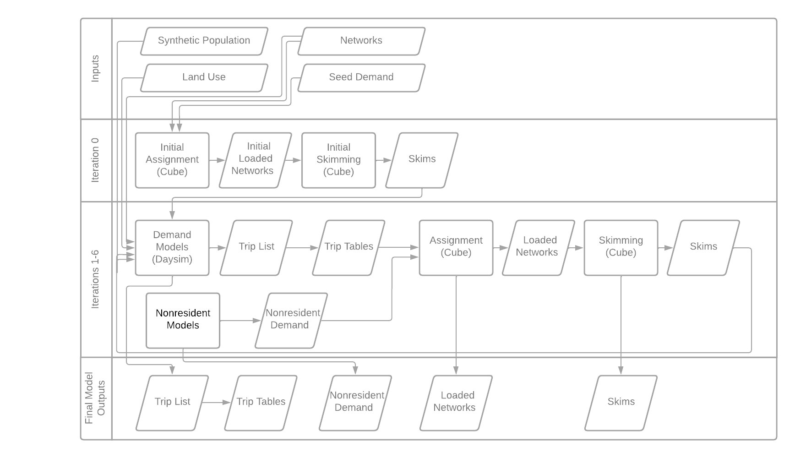

----------------------
Model Structure & Flow
----------------------

Flow Chart
^^^^^^^^^^^^^^^^^^^
SF-CHAMP takes land use, network, synthetic population, and seed demand inputs.  It pre-processes these and runs an initial set of assignments to generate seed skims (impedances).  Then it runs 6 iterations (and can be configured to run more or fewer), each consisting of activity generation, highway assignment and skimming, and transit assignment and skimming.  The model produces outputs that include a disaggregate trip list, loaded networks, and skims.

   
Equilibrium & Convergence
^^^^^^^^^^^^^^^^^^^^^^^^^