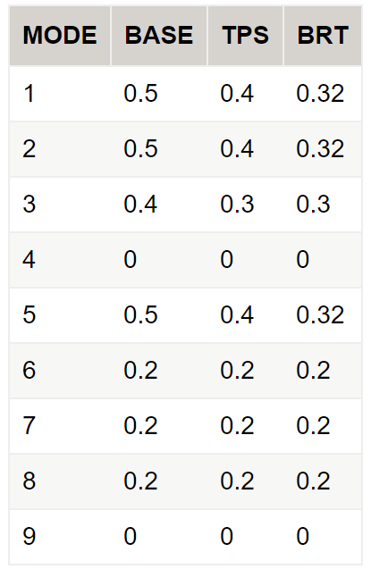

=====================
Network Supply Models
=====================
The supply models consist of assigning travel demand onto transportation networks, and then evaluating how those transportation networks perform. There are separate models for roadway and transit supply. Both models use the Citilabs Cube software package for assignment (assigning trips to networks) and skimming (evaluating travel times and costs for travel between origins and destinations after trips have been assigned to the networks).

Highway Models
---------------
Highway assignment is the process of loading vehicle trips onto the roadway network. In assignment, each vehicle trip searches for a route with the lowest generalized cost (considering travel time and toll costs). The assignment model iteratively reassigns trips until the model converges towards a user-equilibrium condition. Skimming is the process of evaluating the components of generalized cost for all origin and destination pairs. Assignment and skimming is conducted separately for the five SF-CHAMP time of day periods: AM Peak, midday, PM Peak, evening, and late night/early morning.

Highway Assignment
^^^^^^^^^^^^^^^^^^^^

A number of new features were incorporated into the roadway assignment and skimming process for CHAMP 4.3 Fury. These include:  

*	Script consolidation. All highway assignment skimming and assignment scripts were consolidated into a single file, with variables for time-period specific variables (such as peaking factors). The modeling process now dynamically generates versions of the script by time period, for assignment vs skimming, and for distributed computing. This system is easier to update (updates can be made in one source file instead of 5-15 source files), which reduces errors and ensures consistency between the assignment and the skimming.  
*	A new link input variable was added, TOLLTIME, to account for the time required to pay a toll. This variable interacts with link V/C to represent toll plaza congestion effects on travel time.  
*	Roadway skims include a new variable representing congested distance, VC_OVER_08. This variable is used in the mode choice model, so that the additional disutility inherent to driving in congestion from increased stress can be incorporated.  
  
The highway networks are coded in equivalent manner as the networks for the Phase 1 CHAMP 3.1 models, with one additional field indicating if the toll should be treated as a “value toll” and included as a separate alternative in the choice models. Specifically, the network fields related to tolling are:

*	``TOLL{EA,AM,MD,PM,EV}_DA`` – Cost of tolls to single-occupant vehicles in the { Early AM, AM Peak, Mid-Day, PM Peak, or Evening }.  
*	``TOLL{EA,AM,MD,PM,EV}_SR2`` – Cost of tolls to shared-ride 2 vehicles in the { Early AM, AM Peak, Mid-Day, PM Peak, or Evening }.  
*	``TOLL{EA,AM,MD,PM,EV}_SR3`` – Cost of tolls to shared-ride 3+ vehicles in the { Early AM, AM Peak, Mid-Day, PM Peak, or Evening }.  
*	``VALUETOLL_FLAG`` – Binary flag indicating whether or not trips traversing this link should be included in the toll alternative in the choice models.  

All costs are coded in 1989 cents. The value toll flag is important because it distinguishes between the congestion pricing tolls and the background tolls on the Bay Area bridges. Just because someone is willing to pay a toll to cross the Golden Gate Bridge, does not necessarily mean that they are also willing to pay a toll to enter the downtown area. A trip is only included in the toll alternative if it traverses a link where both the value toll flag and the toll for that time period and auto occupancy are greater than zero. If the flag is set to zero, then the toll is still paid, but it is included in the utility equation of the no-toll alternative.  
Highway shortest paths are built based on the generalized cost equation:  

``Generalized Cost = Time + 0.04 * (Distance * 12 + Toll / Occupancy)``
  
This generalized cost assumes a $15/hour value of time for personal travel and $30/hour for commercial vehicles. The generalized cost uses a $0.12/mile auto operating cost. The division of cost by auto occupancy is new in RPM-9 and allows for the sharing of costs among passengers. The auto operating cost is not divided by occupancy because doing so would force the model to predict higher shared ride shares for longer trips, a result that is not seen in the observed data.  

See `LoadedNetworkDecoder <http://intranet2.sfcta.org/Modeling/LoadedNetworkDecoder#Basic_Network_Variables>`_ for documentation on all road network variables.  

See `HighwayAssignmentAndSkims <http://intranet2.sfcta.org/Modeling/HighwayAssignmentAndSkims>`_ for more or to edit.

Highway Skimming
^^^^^^^^^^^^^^^^

Transit skimming and assignment are done using Citilabs Cube Voyager TRNBUILD Program. See the Cube Help for documentation on the file formats, etc. The below documentation will cover CHAMP-specific details.  

Two separate sets of highway skims are built. The toll skims are allowed to use any link in the network, subject to the normal HOV restrictions. The no-toll skims are prevented from using links where the toll and the value toll flag are both greater than zero. The no toll skims include three tables: time, distance, and cost of bridge tolls. The toll skims include four tables: time, distance, cost of bridge tolls, and cost of value tolls. The value tolls need to be skimmed separately such that the availability of toll alternatives can be determined, and such that incremental value toll costs can be set to zero for area pricing scenarios.

Transit Models
---------------
Transit assignment and skimming is similar to highway assignment and skimming, except that transit trips are assigned to the transit network. Transit assignment is inherently more complicated because transit trips can include walk or drive access segments, one or more transit services, and transit trips face a variety of fare policies. SF-CHAMP uses Citilabs Cube software for transit assignment and skimming.

Networks
^^^^^^^^^

Transit assignment and skimming are now done in a lockstep iterative process, driven by ``trnAssign.bat``. The process is as follows:  

(1) Copy the initial transit line files into the transit assignment directory (these will have either initial dwell/access values or they will have those the ones from the end of the previous global iteration).  

(2) Build the temporary roadway networks:  

	*	``LOAD[TIMEPERIOD]_BUSTIME.NET`` is the roadway network with bus times per link, which are defined by the congested time, along with any speed up from TSP (transit signal priority), dedicated transit lanes, TTRP savings (transit travel time reduction plan), etc.  

	*	``LOAD[TIMEPERIOD]_ACCESS.NET`` is ``LOAD[TIMEPERIOD]_BUSTIME.NET`` but with the access links from ``[bus,rail,muni].access``.  

	*	``LOAD[TIMEPERIOD]_XFERS.NET`` is ``LOAD[TIMEPERIOD]_BUSTIME.NET`` but with the xfer links from ``[bus,rail,muni].xfer``.  
	
	*	``[TIMEPERIOD]_walk_suplinks.dat`` are also generated by ``TRNBUILD`` to connect origin TAZs to transit stops.
  
See `TransitAssignmentAndSkims <http://intranet2.sfcta.org/Modeling/TransitAssignmentAndSkims>`_ for more or to edit.

Transit Links Diagram
^^^^^^^^^^^^^^^^^^^^^^

.. image:: resources/transit_links_diagram.png  
  
The grey links are coded in the ``XXX.xfer`` and ``XXX.access`` files and incorporated into the "temp" networks, but they are just used them to generate the other links (walk and drive access and egress, and funnel links). In other words, if one can go from a TAZ to the nearby roadway node (6639 in the diagram), and then to the WNR, and then to the Stop, then the mode 11 link gets generated. The extra modes and links are created in order to be able to see detailed access/egress sources for a given station. However, mode 3 (Muni Metro) is done without the WNR nodes (and PNR nodes but that's because there aren't Muni Metro PNRs) -- they're just done with a direct mode 11 link to the station -- just because there are many Muni Metro off-street nodes and adding all those WNRs was though to be too cumbersome and unnecessary given that there aren't PNRs.
 
Transit Assignment & Skimming
^^^^^^^^^^^^^^^^^^^^^^^^^^^^^^

Transit Coding 
~~~~~~~~~~~~~~

Transit skimming and assignment are done using Citilabs Cube Voyager ``TRNBUILD`` Program. See the Cube Help for documentation on the file formats, etc. The below documentation will cover CHAMP-specific details.  
In the ``TRNBUILD LINE`` statements, the ``MODE`` attribute is defined as the following.  

*Table 4: Champ Transit Modes in CHAMP4.3*  

`Intranet Source <http://intranet2.sfcta.org/Modeling/TransitAssignmentAndSkims>`_   
  
.. image:: resources/table_4.png

Time Periods
~~~~~~~~~~~~

Time periods are the same as specified in TimePeriods (since the standard trip tables are used), except renumbered. So:  

*	``FREQUENCY[1]`` is AM  

*	``FREQUENCY[2]`` is MD  

*	``FREQUENCY[3]`` is PM  

*	``FREQUENCY[4]`` is EV  

*	``FREQUENCY[5]`` is EA  

Transit Priority Signaling (TPS) / Rapid Network
~~~~~~~~~~~~~~~~~~~~~~~~~~~~~~~~~~~~~~~~~~~~~~~~

Transit priority signaling / the Rapid Network is represented in two ways.  

(1) On the roadway network, there are 3 new fields per roadway link: BUSTPS_[AM,OP,PM]. These can be set to:  
  
	*	0 for no transit signal priority  

	*	1 for a 3 second benefit for transit  

	*	2 for a 6 second benefit for transit  

(2) For a given transit line, the OWNER attribute can be set to "TPS". This has the effect of assuming a decreased delay for each stop, implemented in the script that adds delays to the transit line files. The delay is calculated when the networks are written out by the Wrangler function: addDelay().   
  
For (1), These get translated into a fixed travel time benefit per link (such as 3 to 6 seconds) via ``trnSkims/build_tmphwynet_TPS_AM.s``.  

Bus Lanes and Bus Rapid Transit
~~~~~~~~~~~~~~~~~~~~~~~~~~~~~~~
  
BRT is similarly represented, via the roadway network and in the TRNBUILD LINE file.  

(1) The network has 3 fields per roadway link: BUSLANE_[AM,OP,PM]. These can be set to:  
  
	*	0 for no lane treatments,  

	*	1 to represent a diamond lane,  

	*	2 to represent a side BRT lane, or  

	*	3 to represent a center BRT lane.  
  
(2) For a given transit line, the OWNER can also be set to "BRT" in the TNRBUILD LINE file. This affects the per-stop delay for Muni Express buses and Muni Local buses. These per-stop delay reductions represent level floor boarding, proof-of-payment and all door boarding.  
  
Similarly, for (1), these get translated to a percentage travel time benefit per link (such at 17-25%) via ``trnSkims/build_tmphwynet_TPS_AM.s``.
  
Current DWELL times by transit mode number and ``OWNER``:  
  
`Intranet Source <http://intranet2.sfcta.org/Modeling/TransitAssignmentAndSkims>`_  
  

Walk Models
------------

Bike Models
------------

